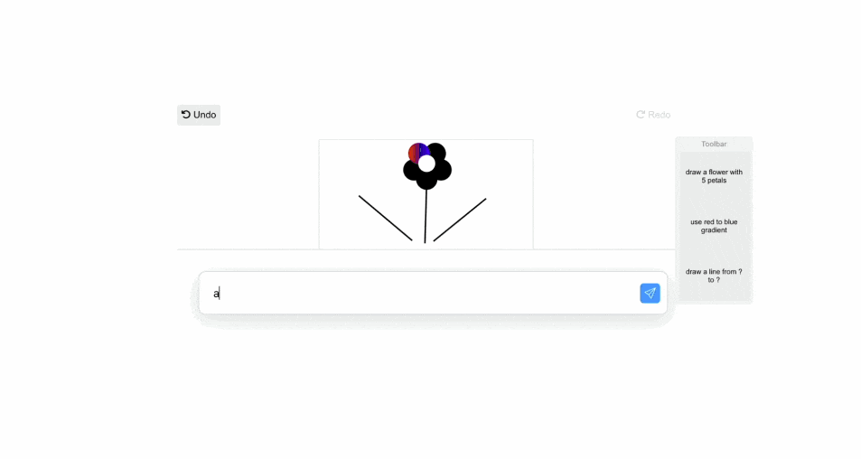

# DirectGPT
### A user interface layer on top of ChatGPT that transforms direct manipulation actions to engineered prompts



__DirectGPT__ is a system that exemplifies how direct manipulation can be used to interact with large language models. The system includes a continuous representation of generated objects of interest; reuse of prompt syntax in a toolbar of commands; manipulable outputs to compose or control the effect of prompts; and undo mechanisms. For more details, see the [accompanying paper](https://arxiv.org/abs/2310.03691).

### [Online Demo](https://damienmasson.com/DirectGPT) / [How to build](#how-to-build-and-run) / [Publication (CHI'24)](#publication)

## How to build and run
The tool was created using TypeScript and React. To run it, you can use npm.
In the project directory, first install all dependencies:
```
npm install
```

Then run the project:
```
npm start
```

Once you started the server, go to this address to access the launcher: http://localhost:3000

## How to use?
After entering your OpenAI API key, you can test DirectGPT using the shortcuts or you can run the study.
Note that the system was tested and developped for recent versions of **Google Chrome** or **Mozilla Firefox**.


## How to get an OpenAI API key?
Because DirectGPT relies on the OpenAI API, you will need a key to make it work. You will need an account properly configured, see [here](https://platform.openai.com/account/api-keys) for more info.
Your key is never stored and the application runs locally and sends requests to the OpenAI API only. To give a rough estimation, running through the whole study is about 20 cents USD and most of the cost comes from the ChatGPT condition.


## Can I try without an API key?
The systen depends on the OpenAI API to work. If you enter an incorrect key, you will still be able to go through the study but executing prompts will yield an error.


## Where are the video tutorials?
From the launcher, you can start the study to see the exact ordering and video tutorials participants went through.
Alternatively, you can go in the ``build/static/tuto`` to review all the video tutorials.


## Publication
> Damien Masson, Sylvain Malacria, Géry Casiez, and Daniel Vogel. 2024. DirectGPT: A Direct Manipulation Interface to Interact with Large Language Models. In Proceedings of the 2024 CHI Conference on Human Factors in Computing Systems (CHI '24) [10.1145/3613904.3642462](https://doi.org/10.1145/3613904.3642462)